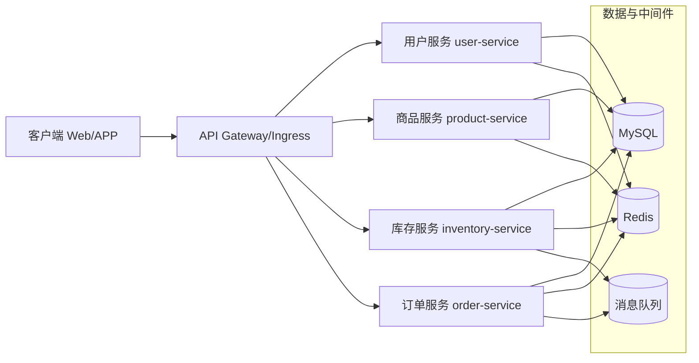
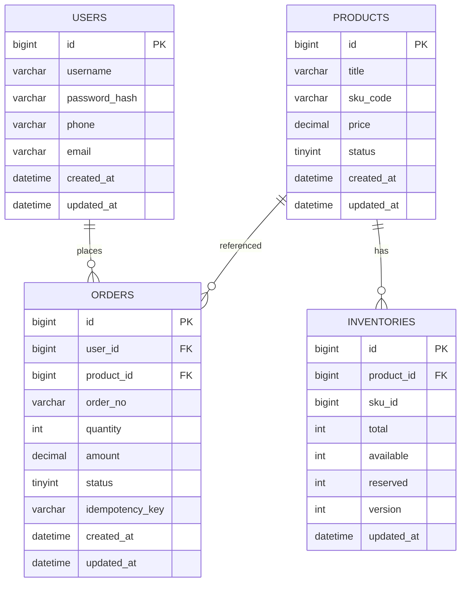

# 商品库存与秒杀系统设计 + 项目骨架（Spring Boot）

## 系统设计文档

### 目标与约束
- **目标**：支持商品浏览、库存扣减、下单支付（此处先实现下单创建）、秒杀高并发下的“防超卖、可追踪、可扩展”。
- **核心约束**：高并发（峰值流量）、库存一致性（不超卖）、接口幂等、可观测、可水平扩展。

### 系统架构草图（服务拆分）
采用微服务拆分（可先单体开发、后按模块拆服务），服务边界如下：用户服务、商品服务、库存服务、订单服务。



#### 服务职责
- **用户服务**：注册/登录、用户资料、鉴权（JWT）、风控基础能力（限流/黑名单可后续加）。
- **商品服务**：商品信息（SPU/SKU）、上下架、价格、活动信息查询（秒杀活动可扩展）。
- **库存服务**：库存查询、预扣/扣减、回滚、对账；秒杀核心一致性点。
- **订单服务**：创建订单、订单状态流转（创建/已支付/已取消/超时关闭）、幂等控制。

### 各服务 API 接口（RESTful，草案）
统一约定：
- Base URL：`/api/v1`
- 认证：`Authorization: Bearer <token>`
- 响应：`{ "code": 0, "message": "OK", "data": ... }`

#### 用户服务（user-service）
- **POST** `/api/v1/users/register`：用户注册（用户名/手机号 + 密码）
- **POST** `/api/v1/users/login`：登录换取 JWT
- **GET** `/api/v1/users/me`：获取当前用户信息（需登录）

请求示例（注册）：
```json
{ "username": "alice", "password": "Passw0rd!" }
```

#### 商品服务（product-service）
- **GET** `/api/v1/products`：分页列表（关键字/类目/上下架）
- **GET** `/api/v1/products/{productId}`：商品详情
- **POST** `/api/v1/products`：创建商品（后台）
- **PATCH** `/api/v1/products/{productId}`：更新商品（后台）

#### 库存服务（inventory-service）
- **GET** `/api/v1/inventories/{skuId}`：查询可用库存
- **POST** `/api/v1/inventories/{skuId}/reserve`：预扣库存（下单前）
- **POST** `/api/v1/inventories/{skuId}/commit`：确认扣减（支付成功/创建订单成功策略二选一）
- **POST** `/api/v1/inventories/{skuId}/release`：释放预扣（取消/超时）

秒杀场景建议（后续实现）：
- Redis 预减库存（Lua 原子）+ 异步落库（MQ）+ 失败补偿（对账任务）
- 或 MySQL 行锁 `update ... set available=available-1 where sku_id=? and available>0`

#### 订单服务（order-service）
- **POST** `/api/v1/orders`：创建订单（幂等键：`Idempotency-Key`）
- **GET** `/api/v1/orders/{orderId}`：订单详情
- **GET** `/api/v1/orders`：我的订单列表
- **POST** `/api/v1/orders/{orderId}/cancel`：取消订单（触发库存释放）

### 数据库 ER 图（用户表、商品表、库存表、订单表）



### 技术栈选型说明（初选）
- **语言**：Java 17
- **框架**：Spring Boot 3（Web/Validation）
- **ORM**：MyBatis（配合 XML/注解 Mapper）
- **数据库**：MySQL 8
- **缓存**：Redis（库存热点、令牌桶限流、会话/黑名单）
- **消息队列**：RabbitMQ / Kafka（异步下单、库存落库、延时关单）
- **网关**：Spring Cloud Gateway / Nginx Ingress（后续按部署形态选择）
- **鉴权**：JWT（用户服务签发；其他服务校验）
- **迁移**：Flyway（建表版本化）
- **容器化**：Docker Compose（本地一键起 MySQL/Redis）

---

## 环境准备（本地开发）
- **JDK**：17+
- **Maven**：3.9+
- **Docker Desktop**：用于启动 MySQL/Redis

启动依赖：
1. `docker compose up -d`
2. 启动 `services/user-service`（IDE 或 `mvn -pl services/user-service spring-boot:run`）

---

## 当前实现进度
- 已规划：多服务拆分、API、ER、选型
- 即将落地：**项目代码框架 + 用户注册/登录（user-service）**

---

## user-service 快速启动（本地）

### 1. 启动依赖
确保安装了 Docker Desktop，然后执行：
1. `docker compose up -d`

### 2. 启动服务
在仓库根目录执行（使用内置 `mvnw` 自动下载 Maven）：
1. `bash mvnw -pl services/user-service spring-boot:run`

服务默认端口：`8081`

### 3. 测试接口
注册：
```bash
curl -s -X POST "http://localhost:8081/api/v1/users/register" \
  -H "Content-Type: application/json" \
  -d '{"username":"alice","password":"Passw0rd!","phone":"13800000000","email":"alice@example.com"}'
```

登录：
```bash
curl -s -X POST "http://localhost:8081/api/v1/users/login" \
  -H "Content-Type: application/json" \
  -d '{"username":"alice","password":"Passw0rd!"}'
```

获取当前用户信息（示例 token 需要替换为登录返回的 token）：
```bash
curl -s -X GET "http://localhost:8081/api/v1/users/me" \
  -H "Authorization: Bearer <token>"
```

